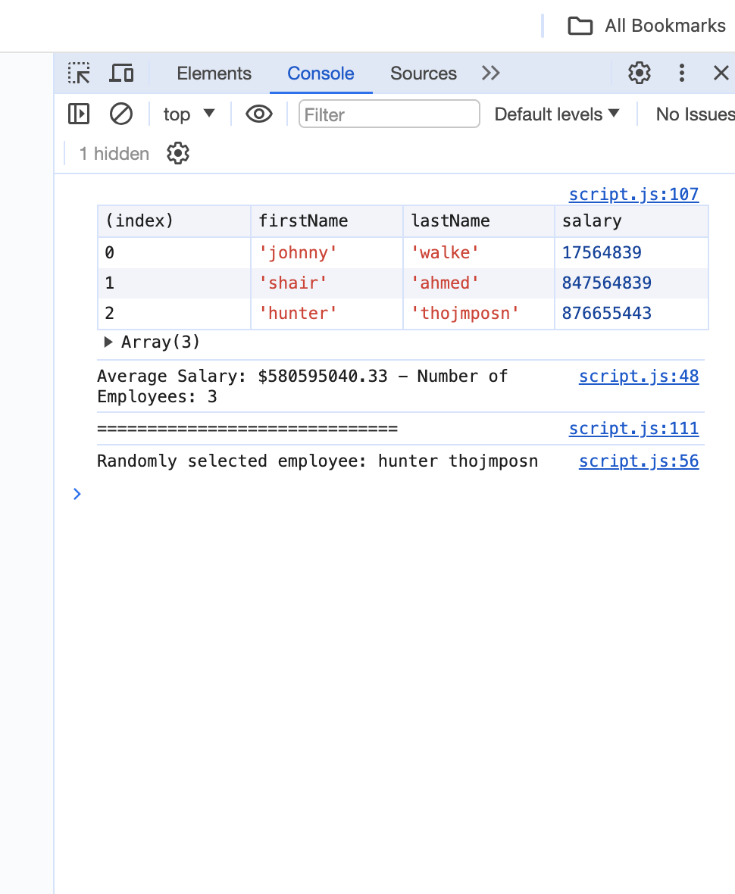

# Homework-3

A webpage that collects employee data, averages their salaries, then randomly selects an employee and displays their name in the console. 

### Usage

.

## Deployment

## License

This project is licensed under the MIT License - see the [LICENSE.md](LICENSE.md) file for details

## Acknowledgments

